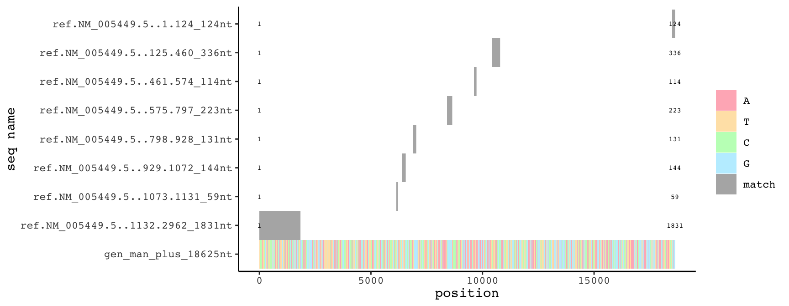

## Recommendations of how to improve this procedure are welcome.
```{r setup, include=FALSE}
knitr::opts_chunk$set(echo = TRUE)
knitr::read_chunk("snp_to_protein.R")
```

```{r setup, echo=TRUE, message=FALSE, cache=T}
```

Single nucleotide polymorphisms (snp) can be acquired from NCBI. They are mapped to genomic nucleotide positions.
But how to map a snp to the corresponding position on protein level in order to find out its effect on the protein (e.g. silent mutation yes/no; premature stop codon induced yes/no, change to a similar aa or to one with very different chemical properties, etc.).  
Below snps within exons of FCMR (FAIM3, Toso), the human Fc receptor for IgM, are mapped to protein level and their effects are plotted in a multiple alignment.  
Data for FCMR are acquired manually and with biomaRt. The latter just to demonstrate that doing this job purely from R is feasible.
```{r get genomic and exon data for FCMR manually, warning=F, cache=T}
```

This kind of plotting is a sanity check to make sure that we know which sequences we have in our variables.
```{r plot exons against genomic seq and cds, fig.width=9, fig.height=3.5, warning=F, cache=T}
```
