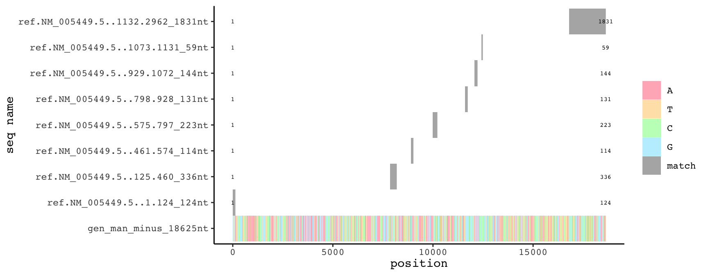
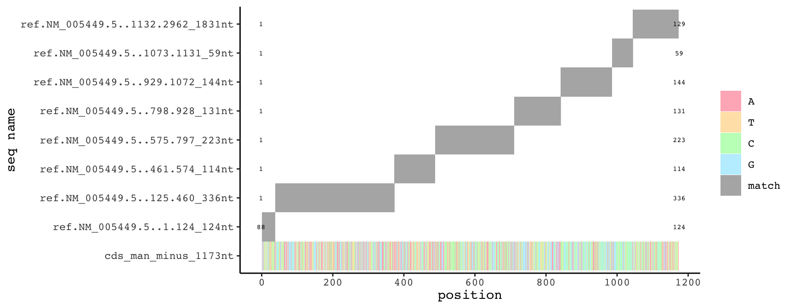
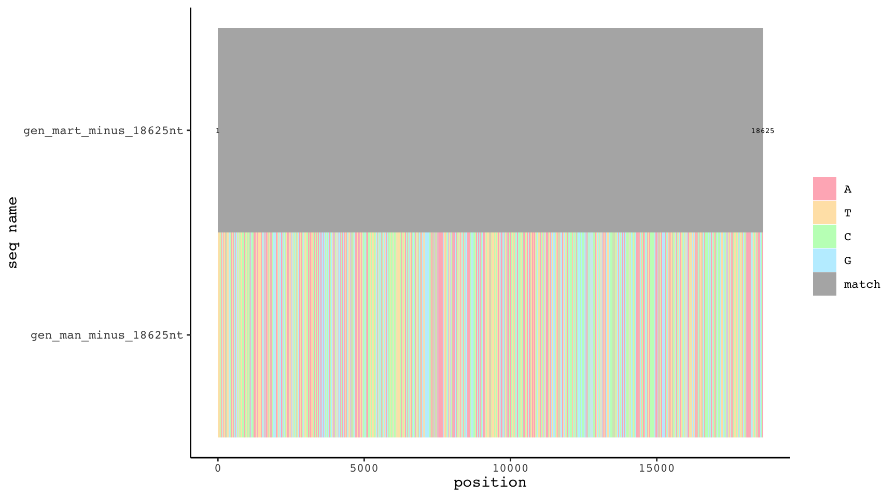
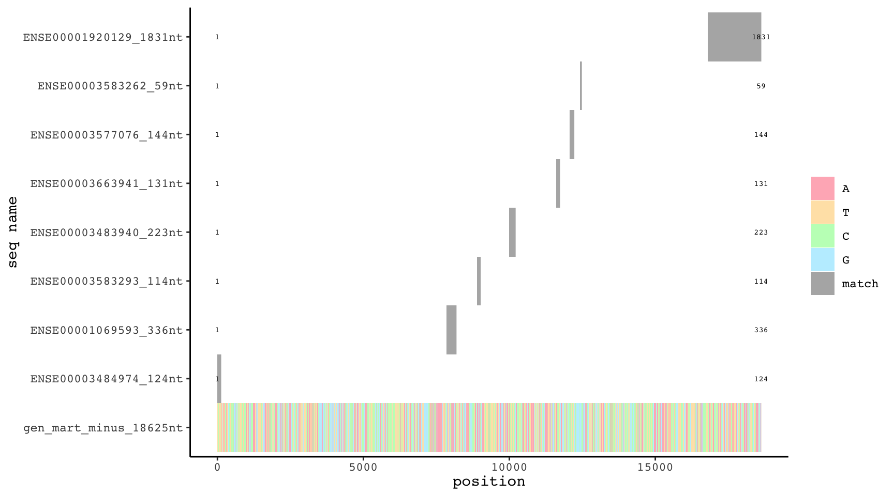
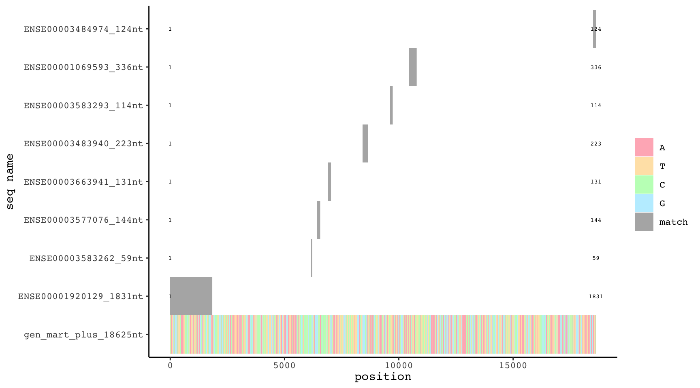
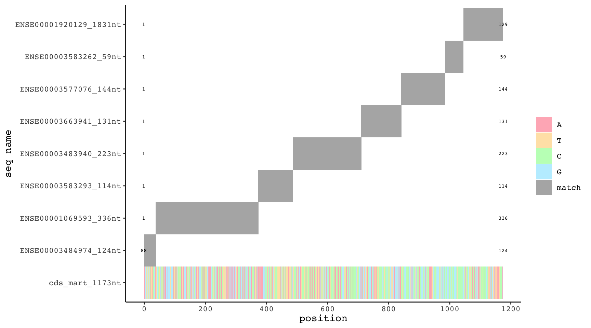
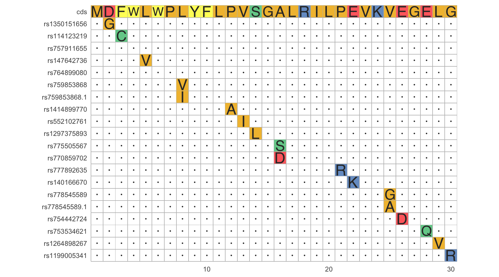

## Recommendations of how to improve this procedure are welcome.
```{r setup, include=FALSE}
knitr::opts_chunk$set(echo = TRUE)
knitr::read_chunk("snp_to_protein.R")
```

```{r setup, echo=TRUE, message=FALSE, cache=T}
```

Single nucleotide polymorphisms (snp) can be acquired from NCBI. They are mapped to genomic nucleotide positions.
But how to map a snp to the corresponding position on protein level in order to find out its effect on the protein (e.g. silent mutation yes/no; premature stop codon induced yes/no, change to a similar aa or to one with very different chemical properties, etc.).  
Below snps within exons of FCMR (FAIM3, Toso), the human Fc receptor for IgM, are mapped to protein level and their effects are plotted in a multiple alignment.  
Data for FCMR are acquired manually and with biomaRt. The latter is included to demonstrate that doing this job purely from R is feasible, though manual verification is advisable.
```{r get genomic and exon data for FCMR manually, warning=F, cache=T}
```

This kind of plotting is a sanity check to make sure that we know which sequences we have in our variables.
```{r plot exons against genomic seq and cds, fig.width=9, fig.height=3.5, warning=F, eval=F}
```





```{r get genomic and exon data for FCMR with bioMart, warning=F, cache=T}
```

Again a sanity check for data from biomaRt.
```{r plot exons against genomic seq and cds 2, fig.width=9, fig.height=3.5, warning=F, eval=F}
```





The pairwise alignments of exons against the genomic sequence matches genomic coordinates to nucleotide positions in exons (or vice versa). Subsequently, this enables us to map genomic snp position to mRNA and protein level.
```{r get genomic start and end positions for each exon,cache=T}
```

Acquisition of snp data from NCBI via R. This is probably also possible with biomaRt.
```{r get snp data,cache=T}
```

Align coding sequence (cds) to exons to find its boundaries.
```{r align cds to exons,cache=T}
```

```{r align cds to exons plot,cache=F, fig.width=9, fig.height=3.5,eval=F}
```

```{r create a data frame with one row for each exonic nucleotide,cache=T}
```

We just inspect snps within the first 30 aa of FCMR. This is totally arbitrary and yields simple plot in the end.
```{r translate snps to their effect on protein level,cache=T}
```

Silent mutations, so when a snp does not change the amino acid, are excluded.
```{r exclude snps which cause a silent mutation,cache=T}
```

```{r mutiple alignment of proteins with snps and plot,cache=T,message=F,fig.width=9, eval=F}
```



